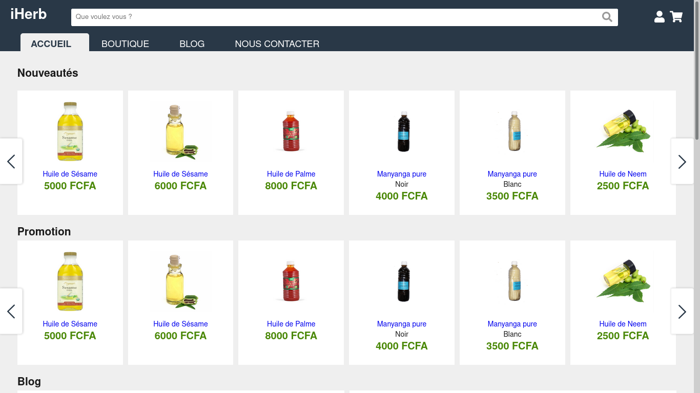

# iHerb
A websiteto get educated about natural vegetables oils and buy some.

## Demo

You need first to load the database. It is located at `database/db.sql`

### Set up the environment

The credentials to connect to the database are located at `app/model.php`

    define('ROOT', str_replace('index.php','',$_SERVER['SCRIPT_FILENAME']));
    private string $username = "root";
    private string $password = "";

The router configurations are located at `index.php`

    $url = $_SERVER['SERVER_ADDR'];
    define('ROOT_URL','http://'.$url.'/');
### Credentials for tests
For demo purposes, we created a user with the following credentials:
- Email : test@test.com
- Password : 123456

By :

- Sesso Kosga
- Koulmen Gael