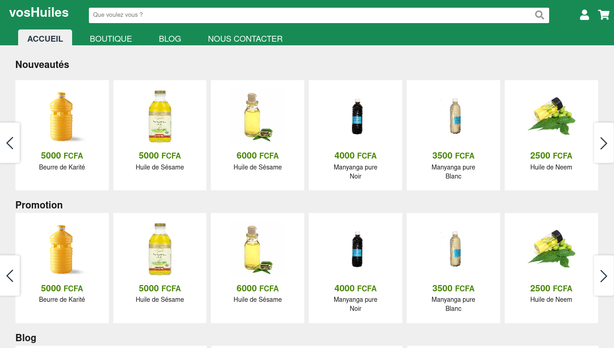

# vosHuiles
A websiteto get educated about natural vegetables oils and buy some.

## Demo

You need first to load the database. It is located at `database/db.sql`

### Set up the environment

The credentials to connect to the database are located at `app/model.php`

    private string $username = "root";
    private string $password = "";

Ofcourse don't forget to load the autoloader with the command:

    composer dump-autoload

### Credentials for tests
For demo purposes, we created a user with the following credentials:
- Email : test@test.com
- Password : 123456

By :

- Sesso Kosga
- Koulmen Gael
